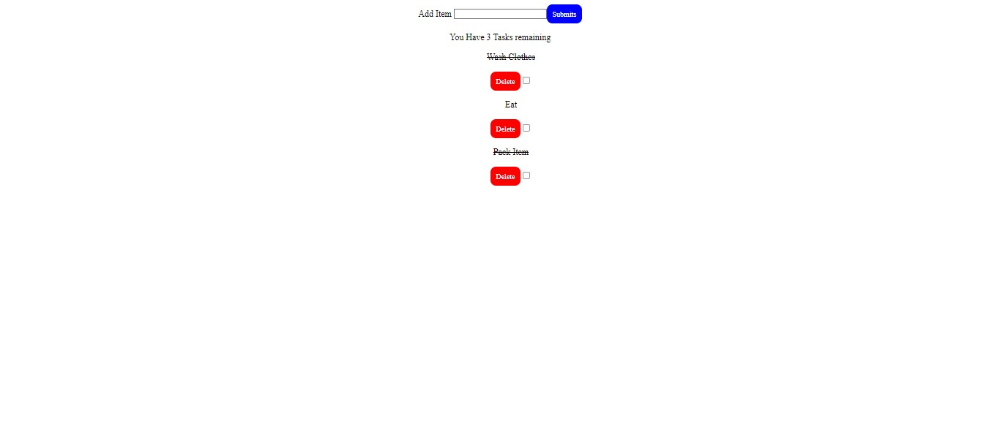

# React ToDo Application
The React ToDo Application is a simple web application that allows users to manage their tasks and keep track of their to-do list. It provides features like adding new tasks, marking tasks as completed, and deleting tasks from the list.

# Images
-I Focused mostly on the functionality, Excuse me for the UI today.

# Key Features

1.Task List: Display a list of tasks with their titles and completion status. Completed tasks can be visually distinguished from pending tasks.

2.Add Task: Provide a form to add new tasks with a title and a checkbox to mark them as completed.

3.Edit Task: Allow users to edit the title of existing tasks.

4.Delete Task: Provide an option to delete tasks from the list.

5.Task Count: Display the total number of tasks and the number of completed tasks..

# Installation
To run the application locally on your machine, follow these steps:

Clone the repository:

git clone https://github.com/Emmanuel687/To-Do---Practise-Case.git

cd react-todo-app

Install dependencies:
npm install

Start the development server:
npm start
Open your web browser and visit http://localhost:3000 to access the application.
Usage

Once the application is running, you can use the following features:-

Add Task: To add a new task, simply type the task description in the input field at the top of the application and press Enter or click the "Add" button.

Mark as Completed: To mark a task as completed, click the checkbox next to the task. A line-through will appear to indicate that the task is completed.

Delete Task: To delete a task, click the "Delete" button next to the task. The task will be removed from the list.

# Contributing
Contributions are welcome! If you find any issues or have suggestions for improvement, please feel free to open an issue or create a pull request.

Fork the repository.
Create a new branch for your feature or bug fix: git checkout -b my-feature.
Commit your changes: git commit -m 'Add new feature'.

Push to the branch: git push origin my-feature.

Open a pull request.

# License
This project is licensed under the MIT License 2023.

